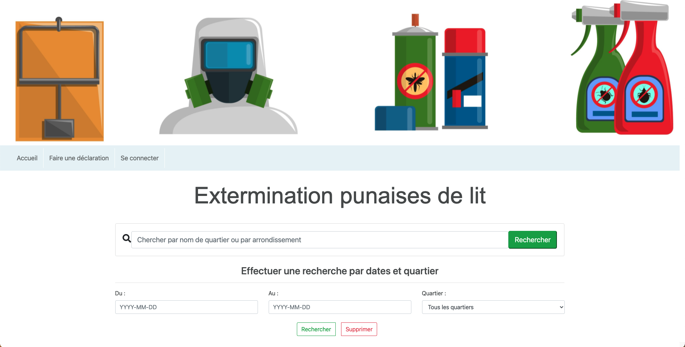
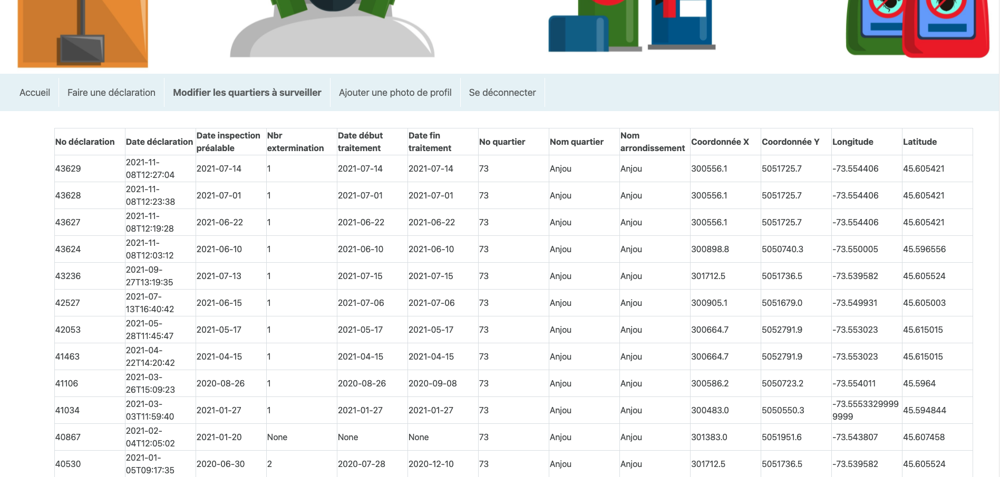
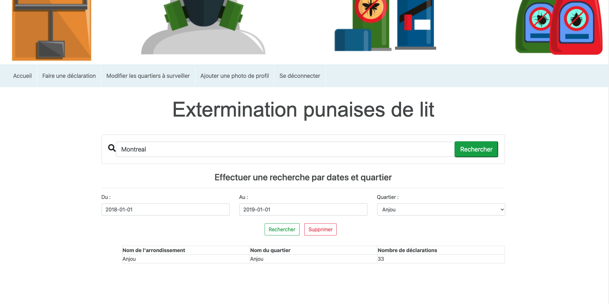
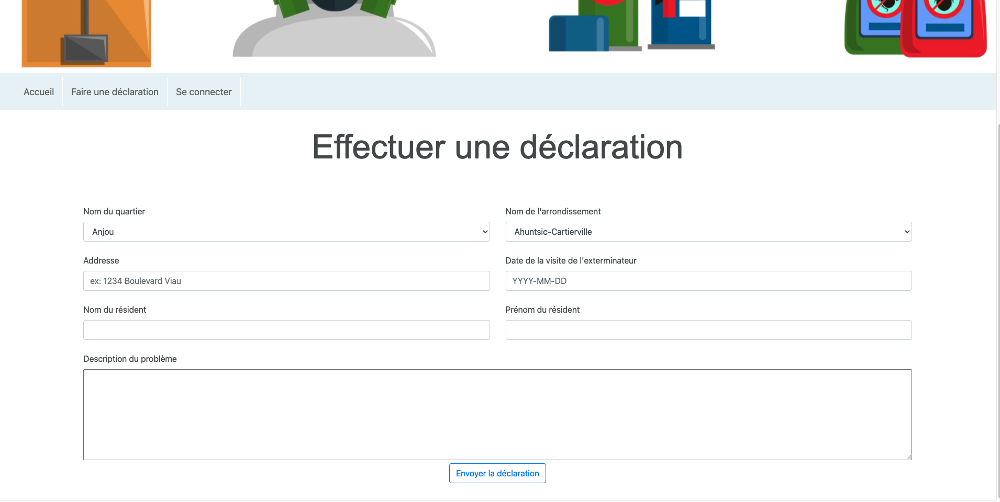

# Recherche de données sur les exterminations de punaises de lit à Montréal 

Ce site permet d'avoir accès en temps réel aux données disponibles sur les exterminations de punaises de lit à Montréal. Il met à la disposition de l'utilisateur différents outils qui lui permette de rechercher les informations sur les déclarations émises selon des quartiers précis. L'utilisateur peut également préciser sa recherche en ajoutant des quartiers spécifiques à surveiller.



Voici un exemple de résultat pour la recherche de l'arrondissement d'Anjou : 



Voici un autre résultat pour une recherche selon une date précise, toujours dans l'arrondissement d'Anjou, un tableau apparaît sur la même page pour les recherches par date : 



Un utilisateur peut également décider d'envoyer une déclaration d'extermination à notre base de données personnelles : 



Enfin, un utilisateur peut créer un compte afin de débloquer différentes fonctionnalités notamment l'ajout d'une photo de profil au compte ou la modification des quartiers à surveiller.


# Suivre ces étapes au lancement du programme

#### 1. Préalables au bon fonctionnement du site

S'assurer d'avoir téléchargé `raml2html` afin de visualiser la documentation :

```
npm i -g raml2html
```

Avec `pip install` :
+ flask
+ pandas
+ apscheduler
+ flask-json-schema

#### 2. Remplir la base de données
Une base de donnée vide au nom de `data.db` est déjà fournis avec le programme, situé dans le dossier `db`.
Afin de remplir les tables des données de la ville, avant même de lancer le programme flask, à partir de
la racine de projet, lancer la commande :
```
python fetch_data.py
```
Le fichier `fetch_data.py` contient le script python pour récupérer les données.

#### 3. Lancer le programme

Pour lancer le programme, simplement taper la commande `make`, ceci générera aussi le
`doc.html` à partir du `doc.raml`. Vous pouvez maintenant utiliser le site.
